# 🧠 AIFlowCraft: Human-AI Workflow Engine

AIFlowCraft is a modular and interactive AI-powered system that enables the generation, review, and validation of end-to-end software artifacts such as user stories, design documents, code snippets, reviews, and QA assessments. It supports both AI and human-in-the-loop decision-making with optional GitHub upload functionality.

---

## 🚀 Features

- **Human-AI Hybrid Workflow**: Choose AI or manual review per stage (User Stories, Design, Code, Review, QA).
- **LangGraph-based Execution**: Modular nodes with pause-resume logic and rejection rerouting.
- **Live Logging**: Real-time log streaming and consolidated logs for full traceability.
- **Feedback Loop**: Captures user feedback and injects it into AI generation.
- **Reference-aware Generation**: Uses uploaded SQLite database content and file inputs for grounded generation.
- **GitHub Upload**: Securely upload final code artifact to GitHub after QA approval.
- **Session Management**: Fully stateful Streamlit UI with dynamic configuration.
- **Workflow Visualization**: Interactive Graphviz diagram and badge-based progress summary.

---

## 🖼️ Interface Overview

- **Sidebar Configuration**:
  - Groq API Key
  - Review Mode Settings (per stage)
  - Advanced Settings (SQLite DB upload)
  - GitHub Upload Settings

- **Main Panel**:
  - Project Input: Text and/or DOCX/PDF file
  - Workflow Diagram (Graphviz)
  - Workflow Summary (live approval/rejection state)
  - Tabbed Outputs for each stage
  - Feedback capture for User Reviews
  - Live Log and Consolidated Log views

---

## 📁 Project Structure

```
AIFlowCraft/
│
├── src/
│   ├── main.py                         # Streamlit app (UI and state)
│   ├── orchestrator/
│   │   └── orchestrator.py             # LangGraph-style node logic
│   ├── agents/
│   │   ├── user_input_agent.py         # User Story generation agent
│   │   ├── design_agent.py             # Design doc generation agent
│   │   ├── code_agent.py               # Code generation agent
│   │   ├── review_agent.py             # Code review agent
│   │   ├── qa_agent.py                 # QA evaluation agent   
│   ├── utils/
│   │   ├── github_helper.py            # GitHub upload logic
│   │   ├── db_reference.py             # DB data extraction for grounding
│   │   └── review_utils.py             # LLM-based approval/rejection logic
│
├── requirements.txt
└── README.md
```

---

## 🧪 Requirements

- Python 3.10+
- Streamlit
- LangChain
- LangGraph
- Groq SDK
- PyPDF2, docx2txt (for file parsing)
- GitPython / requests (for GitHub interaction)

Install everything:
```bash
pip install -r requirements.txt
```

---

## 🔑 Setup

1. Get your **Groq API Key** from [groq.com](https://groq.com/)
2. (Optional) Prepare your **GitHub Token** with `repo` scope
3. Run the app:
```bash
streamlit run src/main.py
```

---

## 🛠️ Usage

1. Enter a brief description of your project (e.g., "multiplication game")
2. Upload any supporting documents (PDF/DOCX)
3. (Optional) Upload a SQLite DB to ground generation
4. Set review modes (AI/User) for each stage
5. Start Workflow — content is generated and reviewed per stage
6. (Optional) Upload final code to GitHub

---

## 📌 Workflow Logic

```mermaid
graph TD
    Start --> USGen --> USRev
    USRev -->|✔| DesignGen --> DesignRev
    DesignRev -->|✔| CodeGen --> CodeRev
    CodeRev -->|✔| ReviewGen --> ReviewRev
    ReviewRev -->|✔| QAGen --> QARev -->|✔| End
    USRev -->|✖| USGen
    DesignRev -->|✖| DesignGen
    CodeRev -->|✖| CodeGen
    ReviewRev -->|✖| CodeGen
    QARev -->|✖| CodeGen
```



---

## 🔐 Security

- API keys and tokens are stored securely using Streamlit session state.
- No credentials are hardcoded.
- GitHub uploads require explicit toggle and credentials.

---

## 📌 Coming Soon

- Test case generation & validation
- Email notifications (if free or optional)
- Versioned snapshots of each stage
- Enhanced error handling and LLM fallback


## 💡 Built With

- [LangGraph](https://github.com/langchain-ai/langgraph)
- [Streamlit](https://streamlit.io/)
- [LangChain](https://www.langchain.com/)
- [Groq LLMs](https://groq.com/)

---

## 🚀 GitHub Deployment (Optional)

After QA approval, you can automatically push the generated code to a GitHub repository.

### ✅ Steps

1. **Create a GitHub Repository**

   - Go to [GitHub](https://github.com/)
   - Click **New Repository**
   - Make sure you **do not initialize with a README**
   - Note the repository name (e.g., `username/repo-name`)

2. **Generate a Personal Access Token (PAT)**

   - Visit: [GitHub Token Settings](https://github.com/settings/tokens)
   - Click **"Generate new token"** (select `Classic` if prompted)
   - Select the `repo` scope at minimum
   - Click **Generate token** and copy it

3. **In AIFlowCraft UI (Sidebar > GitHub Upload)**

   - ✅ Check “Upload code to GitHub after QA”
   - 🔑 Paste your GitHub **Token**
   - 📝 Enter your GitHub repo in this format: `username/repo-name`
   - 📁 Choose target path (e.g., `code/generated_script.py`)

4. **Final Step**

   - On successful QA approval, the app will:
     - Commit the final code
     - Push to the specified path on your GitHub repo
     - Log success or error in the Workflow Log

---

**Note:** The app uses direct [GitHub REST API](https://docs.github.com/en/rest) to push code. Make sure:
- The repo exists and is empty or ready to accept commits
- The token has `repo` permission
- The file path is valid (e.g., no illegal characters or folders that don’t exist unless you want to create them)


---

## 🤝 License

MIT License © 2025

---
